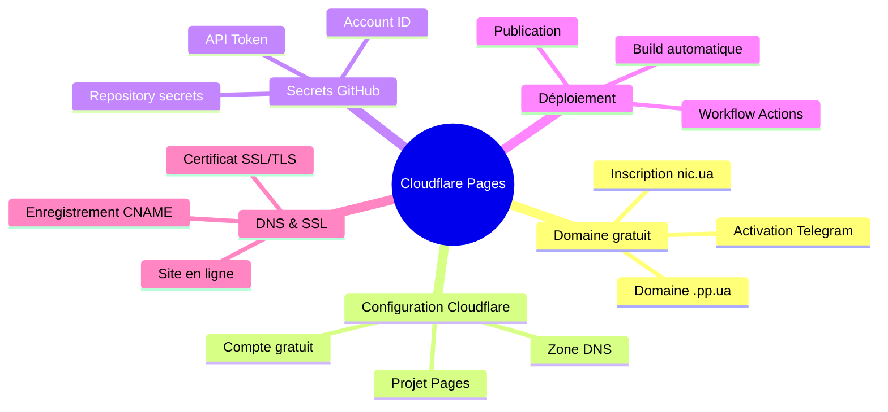
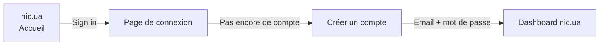
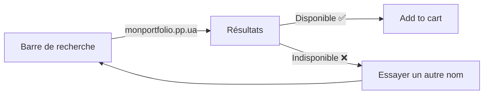
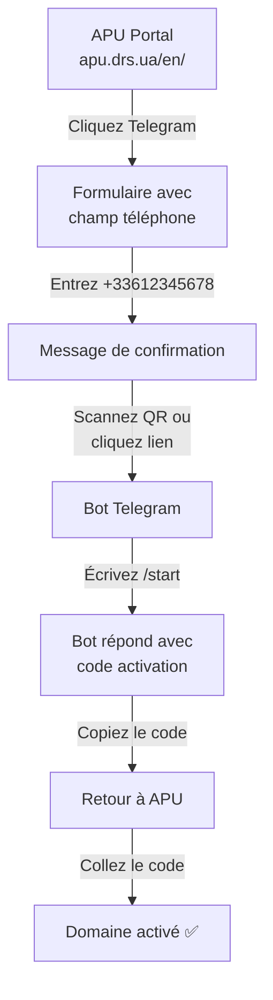
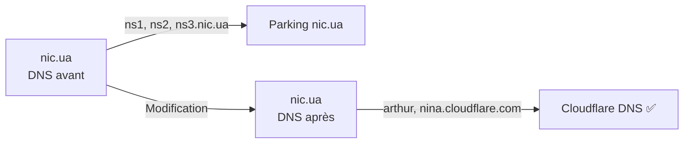
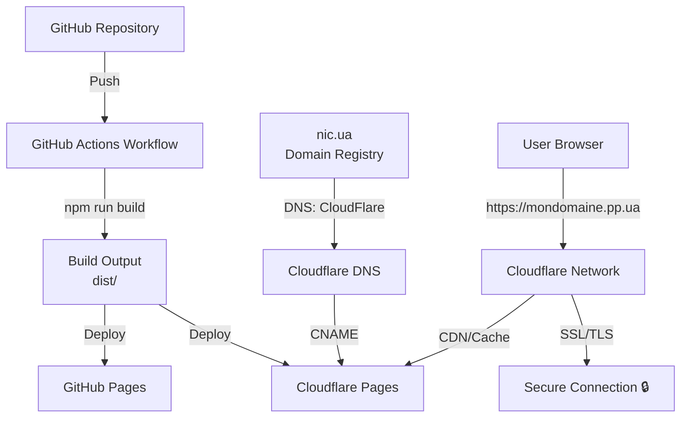

# TP : Publier son site web sur Cloudflare Pages

**BUT Réseau et Télécoms - 1ère année**  
**Durée estimée : 2-3 heures**

---

## 🎯 Objectifs pédagogiques

À la fin de ce TP, vous serez capable de :

- Créer et configurer un domaine gratuit `.pp.ua`
- Paramétrer un compte Cloudflare gratuit
- Modifier vos workflows GitHub Actions pour publier sur Cloudflare Pages
- Gérer les DNS et les certificats SSL/TLS
- Déployer automatiquement votre site web depuis GitHub

---

## 🗺️ Vue d'ensemble du TP



---

## ⚠️ Avertissements importants

### À propos des domaines `.ua`

Les domaines `.ua` correspondent à l'extension de domaine de l'**Ukraine**. Utiliser un domaine `.ua` en tant que développeur français peut être perçu comme un geste politique de solidarité ou de soutien.

**Vous devez être conscient de cette dimension géopolitique avant de procéder.**

Si vous n'êtes pas à l'aise avec ce choix, deux alternatives s'offrent à vous :
- Acheter un domaine `.com` par exemple directement chez Cloudflare (domaine payant)
- Trouver un autre domaine gratuit ou moins politiquement chargé. Si vous trouvez une solution alternative dites le moi…

Le TP suivra la route `.pp.ua`, mais vous pouvez l'adapter à votre choix.

---

## 📝 Prérequis

Avant de commencer, assurez-vous d'avoir :

- ✅ Compte GitHub actif
- ✅ Avoir complété le [TP précédent : Publier son site web sur GitHub Pages](https://github.com/sctg-development/publier-son-site-web-sur-pages)
- ✅ Numéro de téléphone portable au format international (ex: `+33612345678`)
- ✅ Accès à Telegram ou SMS pour l'activation du domaine
- ✅ VS Code installé sur votre ordinateur

---

## 1️⃣ Étape 1 : Créer un domaine gratuit `.pp.ua`

### 1.1 Se connecter à nic.ua

1. Rendez-vous sur [https://nic.ua/en](https://nic.ua)
2. Cliquez sur **Sign in** ou **Register** si c'est votre première visite



### 1.2 Accéder à la section domaines `.pp.ua`

Une fois connecté :

1. Recherchez un domaine en `.pp.ua` via la barre de recherche
2. Entrez le nom de domaine souhaité (ex: `monportfolio.pp.ua`)
3. Cliquez sur la loupe ou appuyez sur Entrée



### 1.3 Choisir votre nom de domaine

Sélectionnez un nom de domaine court et mémorable. Exemple :
- `monportfolio.pp.ua`
- `jean-dupont.pp.ua`
- `devweb-2024.pp.ua`

⚠️ **Important :** Le nom doit être disponible et unique. Vous pouvez tester plusieurs variantes.

```yaml
# Exemples de noms valides :
- votrenom.pp.ua
- votreprojet.pp.ua
- portfolio-iut.pp.ua
```

Cliquez sur **"Add to cart"**.

---

## 2️⃣ Étape 2 : Activer votre domaine `.pp.ua` via Telegram

### ⚡ Pourquoi Telegram et pas SMS ?

Lors de mes tests, **Telegram s'est avéré être la solution la plus fiable à 100%**. Les SMS peuvent être bloqués ou retardés selon votre opérateur mobile. Telegram offre une activation immédiate et sans problème.

### 2.1 Télécharger et configurer Telegram

Si vous n'avez pas Telegram :

1. Téléchargez Telegram depuis [https://telegram.org/apps](https://telegram.org/)
2. Installez l'application sur votre téléphone ou ordinateur
3. Créez un compte avec votre numéro de téléphone au format international

**Format international requis :**
```
+33 (France)
+41 (Suisse)
+32 (Belgique)
…
```

Exemple : `+33612345678` (pas d'espace ni de parenthèses)

### 2.2 Accéder au portail d'activation APU

nic.ua utilise le portail **APU** (Activating Personal User) pour les domaines `.pp.ua`.

1. Allez sur [https://apu.drs.ua/en/](https://apu.drs.ua/en/)
2. Vous verrez un formulaire avec deux options :
   - **Telegram** (recommandé) ✅
   - **SMS**

### 2.3 Procédure d'activation via Telegram

#### Étape A : Entrer votre numéro de téléphone



1. Sur [https://apu.drs.ua/en/](https://apu.drs.ua/en/), sélectionnez **Telegram**
2. Entrez votre numéro au format international : `+33612345678`
3. Cliquez sur **"Send"** ou **"Activate"**

#### Étape B : Contacter le bot Telegram

4. ouvrez l'url https://telegram.me/ppuabot
5. Cliquez sur l'URL ou scannez le code QR → Telegram s'ouvre automatiquement
6. Vous verrez un bot nommé quelque chose comme `@ppuabot`
7. Cliquez sur **"Start"** ou écrivez `/start`

#### Étape C : Obtenir votre code d'activation

8. Le bot Telegram vous répondra avec un **code d'activation** (exemple : `ABC123DEF456`)
9. Copiez ce code (appui long + copie)
10. Retournez sur [https://apu.drs.ua/en/](https://apu.drs.ua/en/) dans votre navigateur
11. Collez le code dans le champ **"Confirmation Code"**
12. Cliquez sur **"Confirm"** ou **"Verify"**

✅ **Votre domaine est maintenant activé !**

### 2.4 Vérifier l'activation sur nic.ua

1. Retournez sur [https://nic.ua](https://nic.ua) après quelques minutes
2. Allez dans **"My Domains"** ou **"Registered Domains"**
3. Vous devez voir votre domaine `.pp.ua` avec le statut **"Active"**

---

## 3️⃣ Étape 3 : Créer un compte Cloudflare gratuit

### 3.1 S'inscrire sur Cloudflare

1. Rendez-vous sur [https://dash.cloudflare.com/sign-up](https://dash.cloudflare.com/sign-up)
2. Entrez votre adresse email
3. Choisissez un mot de passe sécurisé
4. Acceptez les conditions d'utilisation
5. Cliquez sur **"Create account"**

⚠️ **Utilisez une adresse email que vous contrôlez** - vous en aurez besoin pour les étapes suivantes.

### 3.2 Vérifier votre email

Un email de confirmation vous sera envoyé. Cliquez sur le lien **"Verify email"** pour activer votre compte.

### 3.3 Accéder au dashboard Cloudflare

Une fois inscrit et connecté, vous accédez au **Cloudflare Dashboard** : [https://dash.cloudflare.com/](https://dash.cloudflare.com/)

---

## 4️⃣ Étape 4 : Ajouter votre domaine à Cloudflare

### 4.1 Créer une nouvelle zone

1. Sur le dashboard Cloudflare, cliquez sur **"Add site"** ou **"Add domain"** (bouton en haut à droite)
2. Entrez votre domaine : `votredomaine.pp.ua`
3. Cliquez sur **"Add site"**

### 4.2 Sélectionner le plan Free

Cloudflare vous présente plusieurs plans :

| Plan | Coût | Fonctionnalités |
|------|------|-----------------|
| **Free** | Gratuit | DNS, SSL/TLS, accès basique |
| Pro | 20 $/mois | Analytics, WAF avancé, etc. |
| Business | 200 $/mois | Support prioritaire, etc. |

✅ **Sélectionnez le plan "Free"** - il est largement suffisant pour ce TP.

### 4.3 ⚠️ Important : Ne pas importer la zone existante

**ATTENTION : Une option vous proposera d'importer les enregistrements DNS existants.**

```
Manually enter DNS records
```

**C'est important!** Nic.ua a mis en place des enregistrements de "parking" qui contiennent des redirections indésirables.

✅ **Laissez la zone vide** - vous la remplissez plus tard.

Cliquez sur **"Continue"**.

### 4.4 Noter vos DNS Cloudflare

Une nouvelle page affiche vos **DNS primaire et secondaire** Cloudflare. Exemple :

```
DNS Primaire :   arthur.ns.cloudflare.com
DNS Secondaire : nina.ns.cloudflare.com
```

⚠️ **NOTEZ CES DEUX ADRESSES** - vous en aurez besoin à l'étape suivante.

Vous pouvez les copier/coller dans un fichier texte ou un bloc-notes.

```yaml
# Exemple à sauvegarder :
Mon Domaine: monportfolio.pp.ua

Cloudflare DNS:
  Primaire:   arthur.ns.cloudflare.com
  Secondaire: nina.ns.cloudflare.com
```

Cliquez sur **"Continue"** pour terminer la configuration de la zone.

---

## 5️⃣ Étape 5 : Modifier les DNS sur nic.ua

### 5.1 Retourner sur le dashboard nic.ua

1. Connectez-vous à [https://nic.ua](https://nic.ua)
2. Allez dans le dashboard
3. Allez dans **"Domains"**
4. Sélectionnez votre domaine `.pp.ua`

### 5.2 Localiser la section DNS

Dans la page de gestion du domaine, cliquez sur l'engrenage à droite de votre domaine, puis sélectionnez **"NS-servers"**.

### 5.3 Remplacer les DNS par ceux de Cloudflare

Vous verrez actuellement les DNS de nic.ua (DNS de parking) :

```
ns1.nic.ua
ns2.nic.ua
ns3.nic.ua
```

**Remplacez-les par les DNS de Cloudflare** que vous avez notés à l'étape 4.4 en choisissant l'option `Custom Name Servers`  :

```
arthur.ns.cloudflare.com   (DNS Primaire)
nina.ns.cloudflare.com     (DNS Secondaire)
```



### 5.4 Sauvegarder et attendre la propagation

1. Cliquez sur **"Save"**
2. Une notification confirmera le changement

⏱️ **Important :** La propagation des DNS peut prendre **15 minutes à 48 heures**. Généralement, c'est effectif sous 30 minutes.

Vous pouvez vérifier la propagation avec cet outil : [https://dnschecker.org/](https://dnschecker.org/)
- Entrez votre domaine
- Choisissez le type `NS`
- Lancez la recherche
- Vous devez voir `arthur.ns.cloudflare.com` et `nina.ns.cloudflare.com`

---

## 6️⃣ Étape 6 : Générer vos secrets GitHub

### 6.1 Obtenir l'API Token Cloudflare

1. Sur le dashboard Cloudflare, cliquez sur votre **profil** (en haut à droite)
2. Allez dans **"API Tokens"**
3. Cliquez sur **"Create Token"**

### 6.2 Configurer le token

Un formulaire de création de token s'affiche. Vous pouvez :

**Option A : Créer un token personnalisé (recommandé)**

- Sélectionnez les permissions :
  - `Zone.Zone.Read`
  - `Zone.DNS.Edit`
  - `Pages.Build.Edit`
  - `Account.Pages.Edit`
- Zone Resources : Votre domaine
- Cliquez sur **"Create Token"**

**Option B : Utiliser le template prédéfini**

Cloudflare propose un template pour **"Pages Deploy"** - c'est le plus simple pour débuter.

Copiez le token généré (exemple : `6d8f8c9a1b2c3d4e5f6g7h8i9j0k1l2m`).

### 6.3 Obtenir l'Account ID Cloudflare

1. Toujours dans le dashboard, en bas à gauche, vous verrez un encadré **"Account ID"**
2. Copiez cet identifiant (exemple : `a1b2c3d4e5f6g7h8i9j0k1l2m3n4o5p6`)

```yaml
# Vos secrets à sauvegarder temporairement :
CLOUDFLARE_API_TOKEN: 6d8f8c9a1b2c3d4e5f6g7h8i9j0k1l2m
CLOUDFLARE_ACCOUNT_ID: a1b2c3d4e5f6g7h8i9j0k1l2m3n4o5p6
```

### 6.4 Ajouter les secrets à GitHub (niveau dépôt)

⚠️ **IMPORTANT : Vous allez ajouter ces secrets au niveau de votre dépôt GitHub** - ils devront être configurés pour chaque projet.

1. Allez sur GitHub, dans le dépôt de votre site web
2. Cliquez sur **"Settings"** (en haut à droite)
3. Dans le menu de gauche, cliquez sur **"Secrets and variables"** → **"Actions"**
4. Cliquez sur **"New repository secret"**
5. Créez deux secrets :

**Secret 1 :**
```
Name: CLOUDFLARE_API_TOKEN
Value: (collez votre token)
```

**Secret 2 :**
```
Name: CLOUDFLARE_ACCOUNT_ID
Value: (collez votre account ID)
```

4. Cliquez sur **"Add secret"** pour chaque secret

✅ Ces secrets sont maintenant disponibles dans **tous vos dépôts GitHub** !

---

## 7️⃣ Étape 7 : Configurer Cloudflare Pages

### 7.1 Créer un projet Pages dans Cloudflare

1. Sur le dashboard Cloudflare, allez dans **"Build"** (menu de gauche) puis **"Compute and AI"** → **"Workers and Pages"**
2. Cliquez sur **"Create application"**
3. Choisissez **"Upload your static files"**

### 7.2 Créez un zip avec vos fichiers compilés
Avant de continuer, vous devez avoir un fichier ZIP contenant les fichiers compilés de votre site web (généralement le dossier `dist`, `public`, ou `build`).
1. Sur votre ordinateur, créez un fichier ZIP avec le contenu de votre dossier de build
2. Nommez-le `site.zip` ou un nom de votre choix

### 7.3 Télécharger votre fichier ZIP

Dans Cloudflare, glissez-déposez votre fichier ZIP dans la zone prévue à cet effet.

### 7.4 Finaliser la création du projet

Définissez le nom de votre projet (ex: `mon-portfolio`) dans la zone dédiée.
Cliquez sur **"Deploy"**.

Attendez quelques secondes que le déploiement se termine.

### 7.5 Noter le nom de votre projet Pages

Une fois terminé, vous verrez le nom de votre projet Pages. Exemple : `flow-dilution`, `mon-portfolio`, etc.

**Ce nom sera utile pour les workflows GitHub Actions.**

---

## 8️⃣ Étape 8 : Modifier votre workflow GitHub Actions

### 8.1 Ouvrir votre workflow

1. Sur VS Code, allez dans votre projet local
2. Ouvrez le fichier `.github/workflows/deploy.yml` (ou le nom de votre workflow créé précédemment)

### 8.2 Ajouter les étapes Cloudflare

Avant l'étape de déploiement, ajoutez ces nouvelles étapes :

```yaml
      - name: Tell CF that the production branch is the main branch
        continue-on-error: true
        shell: bash
        run: |
          # Adapt the project name to your Cloudflare Pages project
          curl --request PATCH \
              "https://api.cloudflare.com/client/v4/accounts/${{ secrets.CLOUDFLARE_ACCOUNT_ID }}/pages/projects/mon-portfolio" \
              --header "Authorization: Bearer ${{ secrets.CLOUDFLARE_API_TOKEN }}" \
              --header "Content-Type: application/json" \
              --data "{\"production_branch\": \"main\"}" || true

      - name: Publish to Cloudflare Pages
        uses: sctg-development/pages-action-without-url@v2
        with:
          apiToken: ${{ secrets.CLOUDFLARE_API_TOKEN }}
          accountId: ${{ secrets.CLOUDFLARE_ACCOUNT_ID }}
          projectName: mon-portfolio         # Change with your Cloudflare Pages project name
          directory: dist                     # Adapt to your build output directory
          gitHubToken: ${{ secrets.GITHUB_TOKEN }}
```

### 8.3 Adapter les paramètres

Modifiez ces trois lignes avec vos propres informations :

```yaml
# Nom de votre projet Cloudflare Pages
projectName: mon-portfolio

# Nom de votre projet Cloudflare Pages (même valeur)
"...pages/projects/mon-portfolio"

# Répertoire contenant vos fichiers compilés
directory: dist
```

**Comment trouver ces valeurs :**

- **projectName :** Allez dans Cloudflare Dashboard → Pages → Vous verrez le nom du projet
- **directory :** C'est le même que dans votre configuration de build (généralement `dist`, `public`, ou `build`)

### 8.4 Exemple complet

Voici un exemple complet d'un workflow avec GitHub Pages ET Cloudflare Pages :

```yaml
name: Deploy to GitHub Pages

on:
  push:
    branches:
      - main

jobs:
  deploy:
    runs-on: ubuntu-latest
    environment: github-pages
    permissions:
      contents: read
      pages: write
      id-token: write
    steps:
      - name: Checkout
        uses: actions/checkout@v6
      - name: Setup Pages
        uses: actions/configure-pages@v4
      - name: Upload artifact
        uses: actions/upload-pages-artifact@v4
        with:
          path: .
      - name: Deploy to GitHub Pages
        id: deployment
        uses: actions/deploy-pages@v4
      - name: Tell CF that the production branch is the main branch
        continue-on-error: true
        shell: bash
        run: |
          curl --request PATCH \
              "https://api.cloudflare.com/client/v4/accounts/${{ secrets.CLOUDFLARE_ACCOUNT_ID }}/pages/projects/mon-portfolio" \
              --header "Authorization: Bearer ${{ secrets.CLOUDFLARE_API_TOKEN }}" \
              --header "Content-Type: application/json" \
              --data "{\"production_branch\": \"main\"}" || true

      - name: Publish to Cloudflare Pages
        uses: sctg-development/pages-action-without-url@v2
        with:
          apiToken: ${{ secrets.CLOUDFLARE_API_TOKEN }}
          accountId: ${{ secrets.CLOUDFLARE_ACCOUNT_ID }}
          projectName: mon-portfolio
          directory: dist
          gitHubToken: ${{ secrets.GITHUB_TOKEN }}
```

### 8.5 Valider et confirmer

1. Dans VS Code, sauvegardez le fichier
2. Dans le module Git, faites un commit avec le message : `feat: add Cloudflare Pages deployment`
3. Poussez les modifications vers GitHub 

Votre workflow est mis à jour ! À chaque push sur `main`, votre site sera automatiquement déployé sur GitHub Pages **ET** Cloudflare Pages.

---

## 9️⃣ Étape 9 : Pointer votre domaine vers Cloudflare Pages

### 9.1 Configurer le DNS pour votre domaine

Maintenant, vous devez ajouter un enregistrement DNS qui pointe votre domaine vers Cloudflare Pages.

1. Sur Cloudflare Dashboard, allez dans **"DNS"** (menu de gauche)
2. Cliquez sur **"Add record"**

### 9.2 Ajouter un enregistrement CNAME

Vous allez créer un enregistrement **CNAME** :

```yaml
Type:     CNAME
Name:     @ (ou votre domaine complet)
Content:  votredomaine.pp.ua.pages.cloudflare.com
TTL:      Auto
Proxy:    Proxied (bouton orange)
```

**Exemple détaillé :**

```
Type:     CNAME
Name:     monportfolio.pp.ua
Content:  monportfolio.pp.ua.pages.cloudflare.com
TTL:      Auto
Proxy:    Proxied
```

⚠️ **Important :** Assurez-vous que le bouton **"Proxy"** est sur **"Proxied"** (orange) et non "DNS only" (gris).

Cliquez sur **"Save"**.

### 9.3 Configurer le domaine personnalisé dans Cloudflare Pages

1. Allez dans **"Pages"** (menu de gauche)
2. Sélectionnez votre projet
3. Allez dans **"Settings"** → **"Custom domains"**
4. Cliquez sur **"Add custom domain"**
5. Entrez votre domaine : `monportfolio.pp.ua`
6. Cliquez sur **"Continue"**
7. Confirmez que vous avez configuré le DNS CNAME
8. Cliquez sur **"Activate domain"**

✅ Votre domaine est maintenant pointé vers Cloudflare Pages !

---

## 🔟 Étape 10 : Tester votre site

### 10.1 Attendre la propagation DNS

Après avoir ajouté l'enregistrement CNAME, attendez quelques minutes pour la propagation DNS.

Vous pouvez vérifier avec [https://dnschecker.org/](https://dnschecker.org/).

### 10.2 Accéder à votre site

1. Ouvrez votre navigateur
2. Allez sur : `https://votredomaine.pp.ua`

Vous devriez voir votre site s'afficher !

✅ **Félicitations ! Votre site est maintenant publié sur Cloudflare Pages avec un domaine personnel `.pp.ua` !**

### 10.3 Vérifier le certificat SSL/TLS

Cliquez sur le cadenas 🔒 dans la barre d'adresse. Vous devriez voir :

```
Secure
Certificate is valid
Issued by: Cloudflare Inc
```

Cloudflare génère automatiquement un certificat SSL/TLS gratuit pour votre domaine.

---

## � Problèmes courants et solutions

### Problème 1 : Le domaine `.pp.ua` ne s'active pas

**Problème :** Le code d'activation via Telegram ne s'affiche pas ou n'arrive pas.

**Solutions :**
1. Assurez-vous d'avoir utilisé le bon format de téléphone : `+33612345678` (sans espaces)
2. Vérifiez que vous êtes bien connecté à Telegram
3. Rafraîchissez la page APU
4. Essayez l'option SMS si Telegram ne fonctionne toujours pas
5. Attendez quelques minutes et réessayez

### Problème 2 : Le DNS ne se propage pas

**Cause :** Après 48h, le domaine ne pointe toujours pas vers Cloudflare.

**Solutions :**
1. Vérifiez sur [https://dnschecker.org/](https://dnschecker.org/) que les DNS Cloudflare sont bien détectés
2. Sur nic.ua, vérifiez que vous avez bien sauvegardé les DNS
3. Attendez jusqu'à 48 heures (rarement nécessaire, généralement 30 min)
4. Contactez le support de nic.ua ou Cloudflare

### Problème 3 : Le site ne s'affiche pas sur Cloudflare Pages

**Cause :** `mondomaine.pp.ua` retourne une erreur 404 ou "Project not found".

**Solutions :**
1. Vérifiez que votre projet Cloudflare Pages est créé et déployé
2. Vérifiez le nom du projet dans `projectName` de votre workflow
3. Vérifiez que l'enregistrement CNAME dans le DNS Cloudflare pointe vers `mondomaine.pp.ua.pages.cloudflare.com`
4. Attendez quelques minutes après le déploiement GitHub Actions

### Problème 4 : Les secrets GitHub ne fonctionnent pas

**Cause :** Le workflow GitHub Actions échoue avec une erreur d'authentification Cloudflare.

**Solutions :**
1. Vérifiez les noms exactement : `CLOUDFLARE_API_TOKEN` et `CLOUDFLARE_ACCOUNT_ID`
2. Vérifiez que les secrets sont bien ajoutés à votre profil GitHub (pas seulement le dépôt)
3. Copiez les secrets sans espaces ni caractères parasites
4. Vérifiez que le token Cloudflare est toujours valide (certains expirent)

### Problème 5 : Le site s'affiche avec un style cassé

**Cause :** Le site s'affiche mais sans CSS/images.

**Solutions :**
1. Vérifiez que votre `directory` dans le workflow correspond au bon dossier de build
2. Vérifiez que votre `npm run build` génère bien tous les fichiers dans le `directory`
3. Vérifiez que les chemins des ressources (images, CSS) sont relatifs et non absolus

---

## � Annexes

### Annexe A : Architecture complète



---

### Annexe B : Commandes Git utiles

```bash
# Cloner votre dépôt
git clone https://github.com/votreusername/votreprojet.git

# Vérifier le statut
git status

# Ajouter des modifications
git add .

# Committer avec un message
git commit -m "feat: update site content"

# Pousser vers GitHub (déclenche le workflow)
git push origin main

# Voir l'historique des commits
git log --oneline
```

---

### Annexe C : Ressources utiles

| Ressource | Lien | Utilité |
|-----------|------|---------|
| **nic.ua** | [https://nic.ua/](https://nic.ua/) | Gérer votre domaine `.pp.ua` |
| **APU Portal** | [https://apu.drs.ua/en/](https://apu.drs.ua/en/) | Activer votre domaine via Telegram/SMS |
| **Cloudflare** | [https://dash.cloudflare.com/](https://dash.cloudflare.com/) | Dashboard principal |
| **Cloudflare Pages** | [https://pages.cloudflare.com/](https://pages.cloudflare.com/) | Documentation Pages |
| **DNS Checker** | [https://dnschecker.org/](https://dnschecker.org/) | Vérifier la propagation DNS |
| **GitHub Actions** | [https://docs.github.com/actions](https://docs.github.com/actions) | Documentation des workflows |
| **Telegram** | [https://telegram.org/](https://telegram.org/) | Chat pour l'activation |

### Annexe D : Commandes API Cloudflare utiles

```bash
# Vérifier que votre token fonctionne
curl -X GET "https://api.cloudflare.com/client/v4/user/tokens/verify" \
     -H "Authorization: Bearer VOTRE_TOKEN" \
     -H "Content-Type: application/json"

# Lister vos projets Pages
curl -X GET "https://api.cloudflare.com/client/v4/accounts/ACCOUNT_ID/pages/projects" \
     -H "Authorization: Bearer VOTRE_TOKEN" \
     -H "Content-Type: application/json"

# Vérifier le statut d'un déploiement
curl -X GET "https://api.cloudflare.com/client/v4/accounts/ACCOUNT_ID/pages/projects/PROJECT_NAME/deployments" \
     -H "Authorization: Bearer VOTRE_TOKEN" \
     -H "Content-Type: application/json"
```

---

## 🎯 Checklist de fin de TP

Vérifiez que vous avez bien accompli toutes les étapes :

- [ ] Domaine `.pp.ua` créé et activé sur nic.ua
- [ ] DNS changés vers Cloudflare (arthur.ns.cloudflare.com, nina.ns.cloudflare.com)
- [ ] Compte Cloudflare créé et gratuit
- [ ] Projet Cloudflare Pages créé et déployé
- [ ] Secrets GitHub `CLOUDFLARE_API_TOKEN` et `CLOUDFLARE_ACCOUNT_ID` ajoutés
- [ ] Workflow GitHub Actions modifié avec les étapes Cloudflare
- [ ] Enregistrement DNS CNAME ajouté dans Cloudflare
- [ ] Domaine personnalisé configuré dans Cloudflare Pages
- [ ] Site accessible via `https://votredomaine.pp.ua`
- [ ] Certificat SSL/TLS valide (cadenas 🔒)
- [ ] Workflow se déclenche à chaque push sur `main`

---

## 🎓 Pour aller plus loin

### Concepts avancés à explorer

Une fois à l'aise avec les bases, vous pourrez apprendre :

1. **Les Workers Cloudflare** : Exécuter du code JavaScript à la périphérie du réseau
   ```javascript
   // Exemple de Worker simple
   addEventListener('fetch', event => {
     event.respondWith(handleRequest(event.request))
   })
   ```

2. **Les redirections et règles de page** : Configurer des redirections 301/302 dans Cloudflare

3. **Le cache avancé** : Optimiser les performances avec les règles de cache Cloudflare

4. **Les domaines multiples** : Pointer plusieurs domaines vers le même projet

5. **Les environnements de prévisualisation** : Déployer des branches de développement

### Ressources utiles

- **Cloudflare Developers** : [developers.cloudflare.com](https://developers.cloudflare.com/)
- **Cloudflare Pages Docs** : [developers.cloudflare.com/pages](https://developers.cloudflare.com/pages/)
- **DNS pour les débutants** : [cloudflare.com/learning/dns](https://www.cloudflare.com/learning/dns/what-is-dns/)
- **GitHub Actions Docs** : [docs.github.com/actions](https://docs.github.com/actions)

### Projets suggérés

Pour pratiquer, essayez de :

1. Configurer un sous-domaine `blog.votredomaine.pp.ua`
2. Ajouter des règles de redirection personnalisées
3. Mettre en place un Worker pour une API simple
4. Configurer les analytics Cloudflare
5. Déployer un site avec un framework (Astro, Hugo, etc.)

---

## 📝 Notes importantes à retenir

### Les 3 règles d'or du déploiement

1. **Testez localement d'abord** : Vérifiez que votre site fonctionne avant de déployer
2. **Gardez vos secrets secrets** : Ne commitez JAMAIS vos tokens API dans le code
3. **Vérifiez les DNS** : La plupart des problèmes viennent d'une mauvaise configuration DNS

### Sécurité

- 🔒 **Ne partagez JAMAIS** : votre `CLOUDFLARE_API_TOKEN`, il donne accès à votre compte
- 🔒 **Utilisez des tokens avec permissions minimales** : ne donnez que les droits nécessaires
- 🔒 **Renouvelez vos tokens** régulièrement (tous les 6 mois par exemple)
- 🔒 **Activez l'authentification 2FA** sur Cloudflare et GitHub

### Bonnes pratiques DNS

- ⏱️ **TTL bas pendant les tests** : utilisez un TTL de 300s (5 min) pendant la configuration
- ⏱️ **TTL élevé en production** : passez à 3600s (1h) ou plus une fois stable
- 📋 **Documentez vos enregistrements** : gardez une trace de votre configuration DNS

---

## 🎯 Objectifs pédagogiques atteints

À la fin de ce TP, vous devriez être capable de :

- ✅ Expliquer ce qu'est un registrar de domaine et comment fonctionne l'enregistrement
- ✅ Comprendre le rôle des serveurs DNS et la propagation
- ✅ Configurer un compte Cloudflare et gérer une zone DNS
- ✅ Créer et déployer un projet sur Cloudflare Pages
- ✅ Gérer des secrets dans GitHub Actions de manière sécurisée
- ✅ Comprendre le fonctionnement des certificats SSL/TLS
- ✅ Mettre en place un pipeline CI/CD complet
- ✅ Diagnostiquer les problèmes courants de déploiement

---

## 🎉 Conclusion

Félicitations ! Vous venez de franchir une nouvelle étape importante dans votre parcours de développeur web.

Vous avez appris à :
- Gérer un **nom de domaine personnalisé**
- Utiliser un **CDN professionnel** (Cloudflare)
- Automatiser le déploiement avec **GitHub Actions**
- Sécuriser votre site avec **SSL/TLS**

Ces compétences sont utilisées quotidiennement par les développeurs professionnels et les équipes DevOps dans le monde entier. Vous disposez maintenant d'une infrastructure de déploiement **gratuite** et **professionnelle** !

> "Any sufficiently advanced technology is indistinguishable from magic."  
> — Arthur C. Clarke

Mais maintenant, vous savez que ce n'est pas de la magie, c'est juste du **DNS bien configuré** ! 😉

**Bon développement et bonne continuation ! 🚀**

---

## 📚 Sources et références

### Documentation officielle

1. **Cloudflare Pages Documentation** - [developers.cloudflare.com/pages](https://developers.cloudflare.com/pages/)
   - Guide complet pour déployer sur Cloudflare Pages

2. **Cloudflare DNS Documentation** - [developers.cloudflare.com/dns](https://developers.cloudflare.com/dns/)
   - Documentation sur la gestion des DNS

3. **GitHub Actions Documentation** - [docs.github.com/actions](https://docs.github.com/actions)
   - Documentation sur l'automatisation avec GitHub Actions

4. **nic.ua Documentation** - [nic.ua/en/help](https://nic.ua/en/help)
   - Aide pour la gestion des domaines .ua

### Guides et tutoriels

5. **Cloudflare Learning Center** - [cloudflare.com/learning](https://www.cloudflare.com/learning/)
   - Ressources pédagogiques sur le DNS, CDN, SSL, etc.

6. **DNS Checker** - [dnschecker.org](https://dnschecker.org/)
   - Outil pour vérifier la propagation DNS mondiale

7. **SSL Labs** - [ssllabs.com/ssltest](https://www.ssllabs.com/ssltest/)
   - Tester la configuration SSL/TLS de votre site

### Communauté et support

8. **Cloudflare Community** - [community.cloudflare.com](https://community.cloudflare.com/)
   - Forum communautaire Cloudflare

9. **GitHub Community** - [github.community](https://github.community/)
   - Forum communautaire GitHub

10. **Stack Overflow - Cloudflare** - [stackoverflow.com/questions/tagged/cloudflare](https://stackoverflow.com/questions/tagged/cloudflare)
    - Questions/réponses sur Cloudflare

---

**Auteur : Ronan LE MEILLAT - SCTG Development**  
**Audience : Étudiant en BUT R&T**  
**Version du document : 1.0**  
**Dernière mise à jour : Janvier 2026**  
**Licence : CC BY-SA 4.0**
